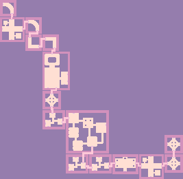
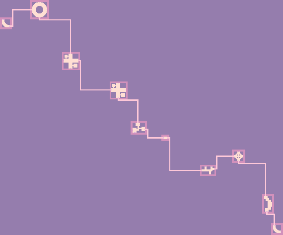
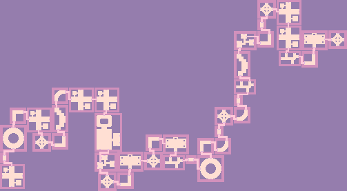
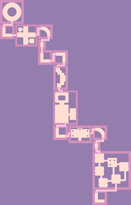
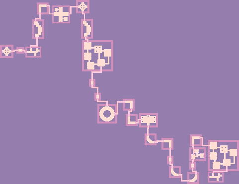
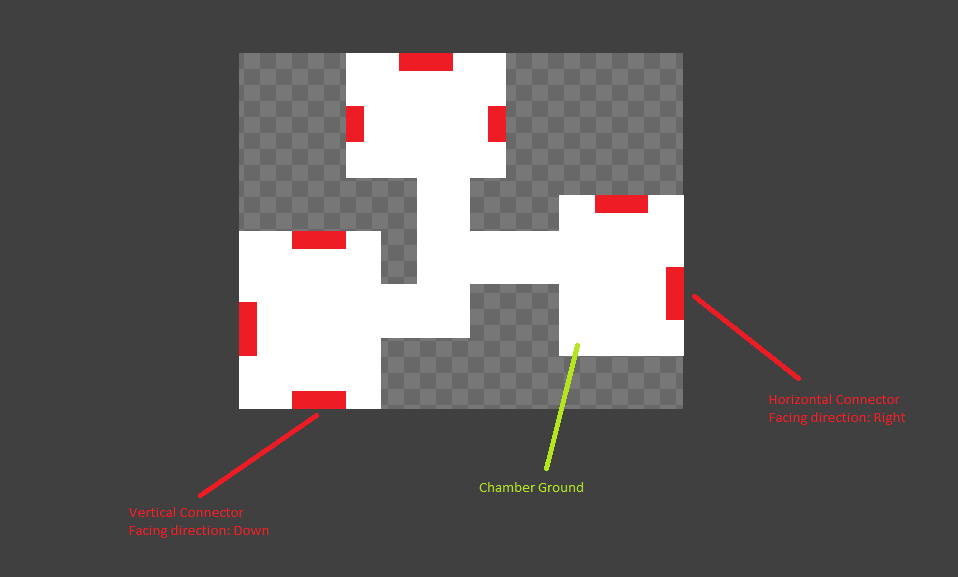

# Random Dungeon Generator (Game Maker Studio 2.3)

<h1>Introduction</h1>

This Random Dungeon Generator combines user-defined chambers to create a dungeon. 
The user-defined chambers are simple sprites that use color coding (user can customize the color detection). 
**The system does not require any objects to use and is easy to integrate into your own project as it can rely only on the provided scripts**
 

<h1>Requirements</h1>

* At least Game Maker Studio 2.3
* Some sprites
 

<h1>Samples</h1>
These are some random dungeons generated using the provided sample chamber sprites. The results shown here are drawn pixel-by-pixel using the underlying ds_grid.  

    

<h2>Output format</h2>

Once the dungeon was created the system will provide a **ds_grid** which contains one of the enumeration-values of the ColorMeaning enumeration. 
The values you will encounter are 

* Connector => A connector was found on this position
* Hallway => A hallway was created on this position, connecting chambers
* ChamberGround => This is chamber ground
* Padding => Padding applied around a chamber. You usually can ignore this
* AutoWall => Walls that were applied around ChamberGround, Hallway and open Connector. Applying auto-walls can be switched on/off in the options
* Unknown => Empty Space

 
In addition to these pre-defined metadata-types you can also defined you own "meanings" using the ColorAssignment-Struct that is used on the RandomDungeonGenerator. 
Take a look at the dungeonCreator-Object on how to define custom colors. 

In addition to the ds_grid you can also retrieve a **ds_list** of placed chambers with information on how each chamber is connected. Use the **placedChambers** property on the DungeonPreset-Struct for this. 

<h2>Creating chamber sprites</h2>

Without chamber sprites there can be no dungeon. 
Each chamber sprite needs some ground and connectors. At least one connector on two different sides need to be placed on a chamber.

<h2>About Connectors</h2>

Connectors come in two variations: **Vertical** and **horizontal**. Depending on how the pixel of a connector are placed on the chamber sprite the connector will either be detected as a horizontal or vertical connector. Vertical connectors have a height of 1 and a width of > 1. Horizontal connectors have a width of 1 and a height of > 1. 
In addition to the connectors orientation it also has a **facing direction**. This facing direction is dependend of the pixels surrounding the connector. For a horizontal connector the facing direction is **left** when the pixel to the right of the connector are chamber ground. The facing direction is **right** when the pixel to the left of the connector are chamber ground. For a vertical connector the facing direction is **up** when the pixel below the connector are chamber ground. The facing direction is **down** when the pixel above the connector are chamber ground. 
 

<h2>About Hallways</h2>

Chambers are connected to each other by hallways. A hallway will be created from one connector to another. Only connectors with the same orientation can be connected (horizontal to horizontal, vertical to vertical). Even with the same orientatin (vertical/horizontal) only connectors with a **opposite facing direction** are able to connect (left to right, right to left, up to down, down to up). The width of a hallway depens on the dimension of the used connector. 
 

<h1>Current limitations</h1>

* Can not limit how many times each chamber is used
* Builts one long dungeon from start to end but does NOT create branches
* Depending on the chamber layout crossing hallways could appear
* Depending on chamber sprite size and amount of chambers to be placed the required ds_grid can become quite large before being cropped. This could potentially crash your game. I would advice testing results with various different amounts of chambers.
